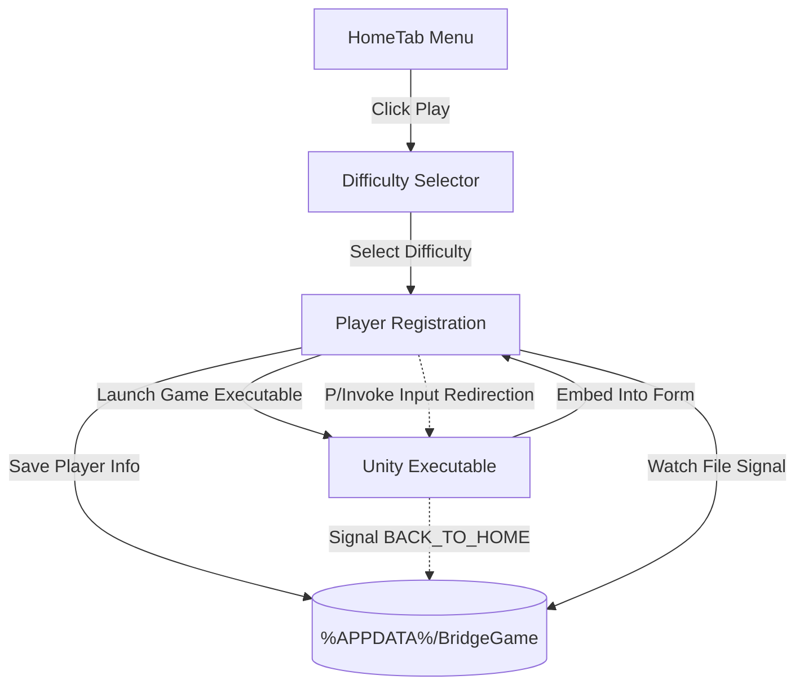

# CodeRun!
CodeRun is an educational 2D platformer game created using Unity Hub seamlessly integrated into a Windows Forms (WinForms) application.

# CodeRun Launcher & Game Host
A modern Windows Forms (WinForms) application targeting .NET 10.0 that acts as a wrapper, launcher, and host for a Unity-based game. It dynamically embeds precompiled Unity game windows into C# WinForms containers using Win32 API P/Invoke calls and redirects keyboard and mouse control inputs to the embedded Unity process.

## 🚀 Key Features
*   **Integrated Launcher UI**: Provides a clean main menu (`HomeTab`), difficulty selection (`PlayDifficulties`), player registration (`PlayerName`), and a credits panel (`CreditsForm`).
*   **Embedded Unity Player**: Instantiates separate Unity processes for different game modes (`Easy`, `Medium`, and `Hard`) and binds the Unity game window inside the WinForms panel using Win32 parent-child window manipulation.
*   **Memory & Process Leak Protection**: Form transitions are managed using parent references (hiding/showing existing instances) rather than instantiating new windows. This guarantees that closing the main form completely terminates the background application process.
*   **Input Translation & Forwarding**:
    *   Intercepts mouse clicks and keyboard commands within the WinForms container.
    *   Uses Win32 `PostMessage` to pass navigation actions (A, D, Space) to the game.
    *   Features a custom mouse-click-to-keystroke mapper for in-game quiz questions (maps click coordinates directly to option keys `1`, `2`, `3`, `4`).
*   **Dynamic Resizing**: Automatically updates the embedded Unity window dimension constraints when the host WinForms application window is resized.
*   **Bidirectional Inter-Process Signaling**: Employs a local signal file (`signal.txt`) to coordinate return-to-home commands from the Unity application, automatically ending the sub-process and restoring the parent menu.
*   **Robust Media Integration**: Includes a story/intro screen (`Story`) with an integrated Windows Media Player control, protected by a runtime fallback script to bypass known Visual Studio designer bugs that mask ActiveX controls.
*   **Player Data Persistence**: Stores player session data (player name and selected difficulty level) locally in the AppData directory.

## 🛠 Tech Stack
*   **Host UI**: Windows Forms (WinForms)
*   **Framework**: .NET 10.0-windows
*   **Game Engine**: Unity (precompiled executables inside specific difficulty folders)
*   **API Integrations**: Win32 DLL Imports (`user32.dll` and `kernel32.dll`)

---

## 🏗 Project Architecture


### Directory Structure
```text
CodeRun/ (Root)
├── GameSceneEasyMode/      # Precompiled Unity executable for Easy Mode
├── GameSceneMediumMode/    # Precompiled Unity executable for Medium Mode
├── GameSceneHardMode/      # Precompiled Unity executable for Hard Mode
├── WinFormsApp1/           # WinForms Source Code Project
│   ├── Program.cs          # Main entry point for the Application
│   ├── HomeTab.cs          # Main dashboard menu form
│   ├── PlayDifficulties.cs # Difficulty level selector form
│   ├── PlayerName.cs       # Player name input, game launching & hosting container
│   ├── Story.cs            # Introduction/intro video screen
│   ├── CreditsForm.cs      # Credits screen form
│   └── CodeRun.csproj      # MSBuild project file targeting .NET 10.0
└── CodeRun.slnx            # Solution configuration file
```

---

## ⚙️ How it Works

### 1. Unity Embedding via P/Invoke
The application leverages the Win32 API to change the parent window of the Unity process, making it a child control of the WinForms container:
```csharp
[DllImport("user32.dll")] 
static extern IntPtr SetParent(IntPtr hWndChild, IntPtr hWndNewParent);
[DllImport("user32.dll")] 
static extern bool MoveWindow(IntPtr hWnd, int X, int Y, int nWidth, int nHeight, bool bRepaint);
```
When starting the Unity process, it passes the WinForms window handle (`Handle.ToInt32()`) with the `-parentHWND` command-line argument:
```csharp
ProcessStartInfo psi = new ProcessStartInfo(gamePath)
{
    Arguments = "-parentHWND " + this.Handle.ToInt32() +
                " -screen-width " + this.ClientSize.Width +
                " -screen-height " + this.ClientSize.Height,
    UseShellExecute = false,
    CreateNoWindow = true
};
unityProcess = Process.Start(psi);
```

### 2. Focus and Input Handling
Because the Unity window is running as a child process inside a WinForms window, standard WinForms focus rules can block keyboard/mouse input propagation. The host manages this by attaching thread inputs:
```csharp
[DllImport("user32.dll")] static extern bool AttachThreadInput(uint idAttach, uint idAttachTo, bool fAttach);
[DllImport("user32.dll")] static extern IntPtr SetFocus(IntPtr hWnd);
[DllImport("user32.dll")] static extern bool SetForegroundWindow(IntPtr hWnd);
```
Keyboard events captured by the host form are sent directly to the Unity thread using `PostMessage`:
```csharp
[DllImport("user32.dll")] 
static extern bool PostMessage(IntPtr hWnd, uint Msg, IntPtr wParam, IntPtr lParam);
```

### 3. Quiz Mode Coordinate-to-Key Translation
When the user clicks in the bottom quiz panel region of the game window, the coordinate percent values are evaluated. Clicking one of the four quiz quarters triggers a `PostMessage` for the corresponding keyboard inputs:
*   **Top-Left Quadrant**: Sends key `1` (`0x31`)
*   **Top-Right Quadrant**: Sends key `2` (`0x32`)
*   **Bottom-Left Quadrant**: Sends key `3` (`0x33`)
*   **Bottom-Right Quadrant**: Sends key `4` (`0x34`)

### 4. Game Exit and Return Signal
The launcher tracks when the Unity game completes or exits using two checks:
1.  **Process exit**: The host checks `unityProcess.HasExited`.
2.  **File Watcher**: A timer monitors `%APPDATA%\BridgeGame\signal.txt` every second. If Unity writes `BACK_TO_HOME`, the launcher:
    *   Deletes the signal file.
    *   Terminates the Unity process.
    *   Restores and shows the parent `HomeTab` menu instance.
    *   Closes the hosting window.

### 5. Designer-Bug Protection for ActiveX controls
Due to a known Visual Studio Windows Forms designer issue where COM reference variables (like `AxWindowsMediaPlayer`) are redeclared locally inside `InitializeComponent()`, the application dynamically resolves references at runtime if they are null on load:
```csharp
if (this.axWindowsMediaPlayer1 == null)
{
    foreach (Control ctrl in this.Controls)
    {
        if (ctrl is AxWMPLib.AxWindowsMediaPlayer player)
        {
            this.axWindowsMediaPlayer1 = player;
            break;
        }
    }
}
```

---

## 💾 Local Storage Paths
*   **Player Data File**: `%APPDATA%\BridgeGame\playerdata.txt`
    *   Format:
        ```text
        Name=PlayerName
        Difficulty=Easy
        ```
*   **Signal File**: `%APPDATA%\BridgeGame\signal.txt`
    *   Format:
        ```text
        BACK_TO_HOME
        ```

---

## 🚀 Running the Project

### Prerequisites
*   Windows OS (dependencies on User32 and Kernel32 DLLs)
*   .NET 10.0 SDK or higher
*   Visual Studio 2022 / JetBrains Rider

### Build & Run
1.  Clone or download this repository.
2.  Open the solution file [CodeRun.slnx](file:///c:/Users/oreto/OneDrive/Desktop/CodeRun/CodeRun.slnx) in Visual Studio.
3.  Ensure the executable files exist in their respective directories (e.g. `GameSceneEasyMode\My project (2).exe`).
4.  Build and run the project `CodeRun` in Visual Studio (using MSBuild compiles the Active X COM components successfully).
